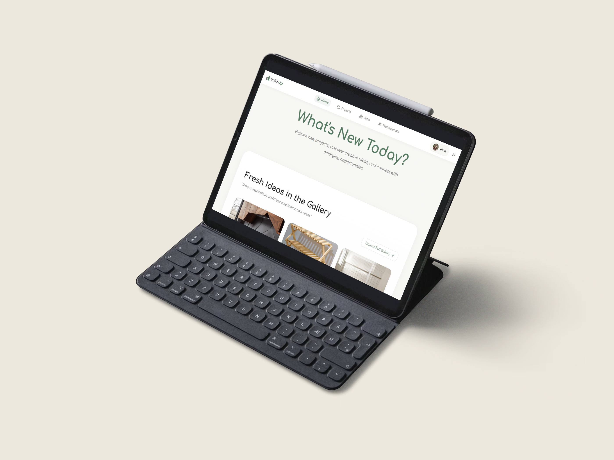
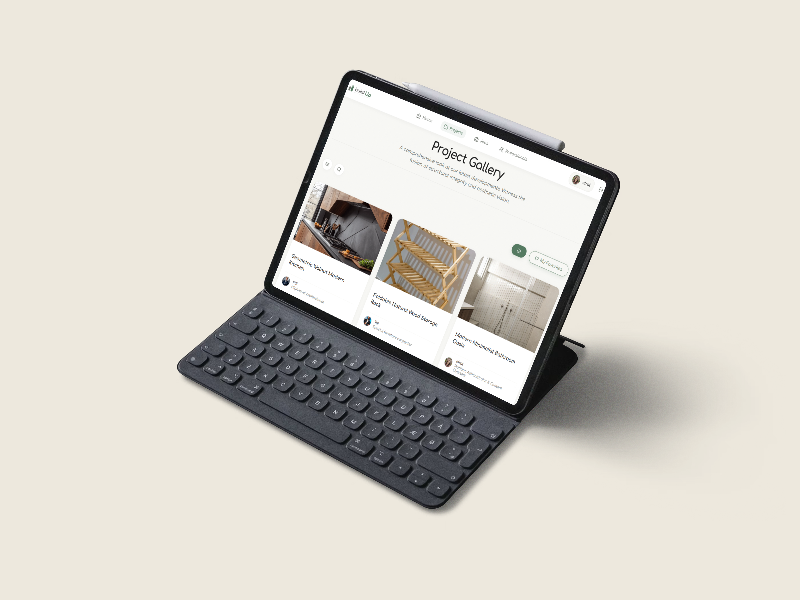
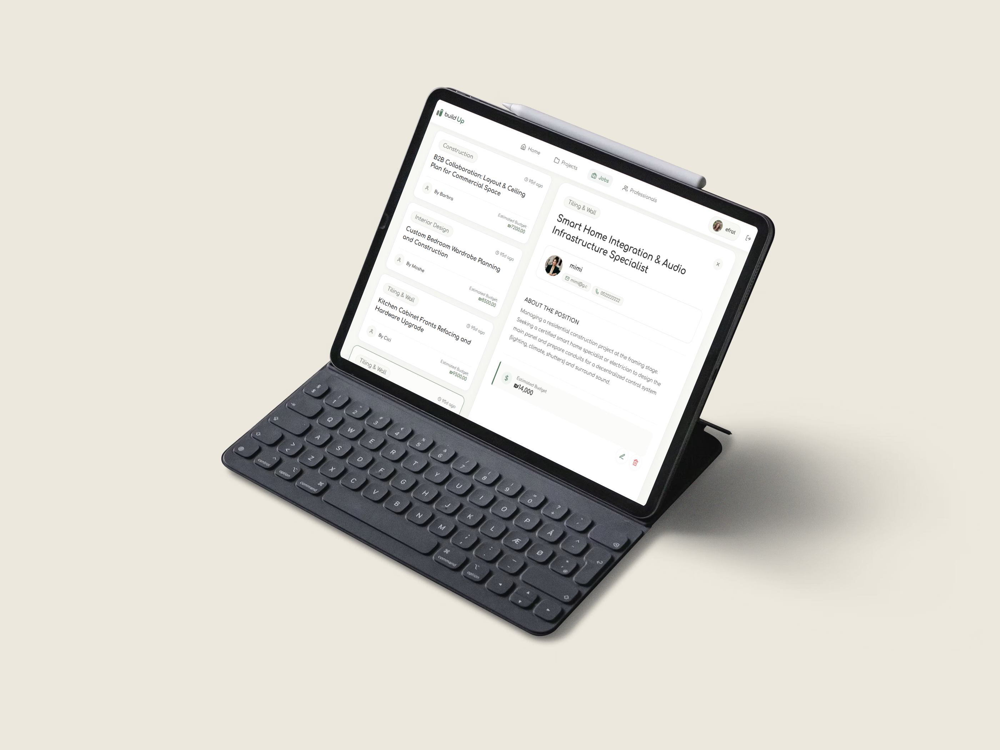

# BuildUp

### Full-Stack Community Platform for Home Design & Renovation

A full-stack web platform that connects homeowners with professionals in the home design and renovation industry, including contractors, kitchen designers, architects, and furniture professionals.

[🚀 Live Demo](https://build-up-ra99.vercel.app/) · [💻 GitHub](https://github.com/efratdehas/BuildUp) · [🎨 Screenshots & Demo](YOUR_DRIVE_FOLDER_LINK)

---

## ✨ Overview

BuildUp brings professional discovery, portfolios, reviews, and category-based browsing into one platform.

The system allows professionals to showcase their work and manage their presence, while users can explore professionals, browse portfolios, and interact with their profiles.

The project was built as a full-stack application with a React client, Node.js/Express backend, and MySQL database.

---

## 🚀 Key Features

* 👤 Role-based user experience
* 🔐 Authentication & authorization
* 🏢 Professional profiles and portfolios
* ⭐ Reviews and ratings
* 🖼️ Media and portfolio uploads
* 🗂️ Category-based professional discovery
* 📊 Category-specific dashboards
* 🔄 Shared state management with React Context
* 🌐 RESTful communication between client and server

---

## 🛠️ Tech Stack

**Frontend:** React · JavaScript · HTML5 · CSS3
**Backend:** Node.js · Express.js
**Database:** MySQL
**Tools:** Git · GitHub

---

## 🏗️ Architecture

BuildUp follows a client-server architecture with a clear separation between the frontend, backend, and database layers.

```text
┌─────────────────────────────┐
│        React Client         │
│  Components · Context · UI  │
└──────────────┬──────────────┘
               │ HTTP / REST API
               ▼
┌─────────────────────────────┐
│      Node.js / Express      │
│  Routes · Logic · Auth      │
└──────────────┬──────────────┘
               │ SQL
               ▼
┌─────────────────────────────┐
│           MySQL             │
│ Users · Profiles · Reviews  │
│ Categories · Content · ...  │
└─────────────────────────────┘
```

This separation keeps UI, application logic, and data management independent and maintainable.

---

## ⚙️ Technical Highlights

### Role-Based Architecture

The application adapts available functionality according to the user's role, with protected operations handled through the backend.

### React Context

Shared application state is managed with React Context, reducing unnecessary prop drilling and keeping state accessible across relevant components.

### Reusable Components

The frontend is built from reusable React components, allowing common UI patterns and functionality to be shared across different sections of the application.

### Full-Stack Data Flow

```text
User Interaction
      ↓
React Component
      ↓
REST API Request
      ↓
Express Route
      ↓
Server Logic
      ↓
MySQL
      ↓
API Response
      ↓
UI Update
```

---

## 🧩 Challenges & Solutions

### Managing Shared State

As the application grew, multiple components needed access to shared information.

**Solution:** Used React Context to centralize shared state and make it accessible throughout the relevant parts of the application.

### Connecting Role-Based UI with Backend Permissions

Different user types require different functionality and access levels.

**Solution:** Structured the application around user roles, connecting frontend flows with backend authorization.

### Maintaining Frontend / Backend Separation

Keeping UI concerns separate from server-side logic became increasingly important as the project expanded.

**Solution:** Organized the application into dedicated client and server layers communicating through REST APIs.

---

## 👩‍💻 My Role

I designed and developed BuildUp as a full-stack project, working across both frontend and backend.

My work included application architecture, React development, REST APIs, MySQL integration, authentication and authorization, reusable components, state management, category-based flows, media handling, and debugging across the full stack.

---

## 🖥️ Screenshots & Demo

A visual showcase of BuildUp, including application screenshots, polished mockups, and a short screen recording demonstrating the main flows.




[**🎨 View Full Screenshots & Demo**](https://drive.google.com/drive/folders/1lPI5FmPI41snzWDykjybVTd37F8Y1MaT?usp=sharing)

---

## 🔮 Future Improvements

* 💬 Real-time messaging with Socket.IO
* 📊 Analytics dashboards for professionals
* 🔎 Advanced search and filtering
* ❤️ Favorites and saved professionals
* 🔔 Notifications
* 🧠 Personalized professional recommendations

---

## 🚀 Getting Started

```bash
git clone https://github.com/efratdehas/BuildUp.git
cd BuildUp

cd client
npm install

cd ../server
npm install
```

Configure the required environment variables and database connection, then start the client and server according to the project configuration.
